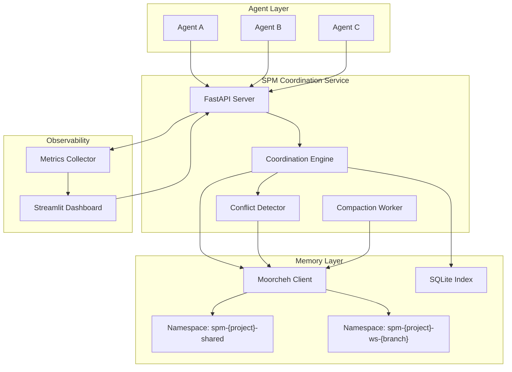

# SPM — Shared Agent Memory Layer

> **"Memory-in-a-Box becomes a multi-agent brain."**

SPM is a production-ready coordination middleware that prevents merge conflicts, duplicate reasoning, and lost architectural decisions when multiple AI coding agents work in parallel on the same codebase.

## Architecture



## Quick Start

### Local (no Docker)

```bash
# 1. Clone and install
git clone <repo-url>
cd genai-genesis-2026
pip install -r requirements.txt

# 2. Configure
cp .env.example .env
# Edit .env — at minimum set MOORCHEH_API_KEY (or leave blank for local fallback)

# 3. Start the API server
python -m src.main --port 8000

# 4. Run the demo
python scripts/ingest_demo.py

# 5. Start the dashboard (separate terminal)
streamlit run src/ui/app.py
```

### Docker Compose

```bash
cp .env.example .env
docker-compose up --build
```

- API: http://localhost:8000/docs
- Dashboard: http://localhost:8501

## Environment Setup

| Variable | Default | Description |
|---|---|---|
| `MOORCHEH_API_KEY` | `` | Moorcheh API key (blank = local fallback) |
| `MOORCHEH_BASE_URL` | `https://api.moorcheh.ai/v1` | Moorcheh endpoint |
| `SPM_PROJECT_ID` | `default-project` | Default project namespace |
| `SPM_LOG_LEVEL` | `INFO` | Log verbosity |
| `OPENAI_API_KEY` | `` | For LLM-powered compaction summaries |
| `LLM_PROVIDER` | `openai` | `openai` \| `anthropic` \| `local` |
| `COMPACTION_THRESHOLD` | `50` | Events before auto-compaction triggers |
| `COMPACTION_IMPORTANCE_MAX` | `3` | Max importance level eligible for compaction |
| `SQLITE_PATH` | `data/spm_index.db` | SQLite index file |
| `FALLBACK_DIR` | `data/fallback` | Local JSON fallback directory |
| `API_HOST` | `0.0.0.0` | API bind host |
| `API_PORT` | `8000` | API bind port |
| `TOP_K_SEARCH` | `5` | Default similarity search result count |

## Running the Demo

```bash
# Full end-to-end demo (starts server, runs scenario, compacts, benchmarks)
python scripts/run_demo.py

# Just the 3-agent scenario (server must already be running)
python scripts/ingest_demo.py

# Dry run (no API calls, just prints what would happen)
python scripts/ingest_demo.py --dry-run

# Benchmark only
python scripts/benchmark.py --iterations 50
```

## API Reference

All endpoints are documented at http://localhost:8000/docs (Swagger UI).

| Method | Path | Description |
|--------|------|-------------|
| `GET` | `/health` | Service health check |
| `POST` | `/claims` | Agent claims a task |
| `PATCH` | `/claims/{record_id}` | Update task status |
| `GET` | `/claims/{project_id}` | List all claims for project |
| `GET` | `/execution-order/{project_id}/{workspace_id}` | Suggested execution order |
| `POST` | `/decisions` | Record an architectural decision |
| `POST` | `/plan-steps` | Record a plan step |
| `POST` | `/file-intents` | Record file change intent (triggers conflict detection) |
| `GET` | `/conflicts/{project_id}` | List conflict alerts |
| `POST` | `/query` | Query shared memory (semantic search + grounded answer) |
| `POST` | `/merge` | Merge workspace records |
| `POST` | `/compact` | Trigger memory compaction |
| `GET` | `/metrics` | Metrics summary |

### Example: Claim a Task

```bash
curl -X POST http://localhost:8000/claims \
  -H "Content-Type: application/json" \
  -d '{
    "agent_id": "agent-a",
    "project_id": "my-project",
    "workspace_id": "feature-auth",
    "task_description": "Refactor authentication module",
    "file_paths": ["src/auth/login.py", "src/auth/session.py"]
  }'
```

Response:
```json
{
  "status": "claimed",
  "record_id": "task_claim:my-project:20240101T120000:a1b2c3d4",
  "conflicts": [],
  "risk_score": 0.0,
  "recommendation": "proceed",
  "suggested_order": []
}
```

### Example: Query Shared Memory

```bash
curl -X POST http://localhost:8000/query \
  -H "Content-Type: application/json" \
  -d '{
    "question": "What is the current plan for authentication?",
    "project_id": "my-project",
    "workspace_id": "shared",
    "agent_id": "agent-c"
  }'
```

## Dashboard

The Streamlit dashboard (http://localhost:8501) shows:

1. **Active Claims** — table of in-progress agent tasks with files and timestamps
2. **Conflict Alerts** — color-coded risk scores (🔴 block / 🟡 warn / 🟢 proceed) with channel breakdown
3. **Memory Statistics** — record counts, total chars, compression ratio
4. **Latency Histogram** — operation latency distribution across all API calls
5. **Query Console** — type any question, get a grounded answer with source citations

## Metrics Explained

| Metric | Description |
|--------|-------------|
| **Compression ratio** | `chars_before / chars_after` after compaction. Target: 5-10x application-layer compression. |
| **Grounding rate** | Fraction of query answers backed by at least one cited memory record. |
| **Conflict prevention rate** | Fraction of detected conflicts that were blocked or warned before execution. |
| **p50/p95/p99 latency** | Retrieval latency percentiles per operation type. |

## Testing

```bash
pytest tests/ -v
```

Tests use the local JSON fallback (no Moorcheh SDK required) and in-memory SQLite.

## Project Structure

```
src/
  api/          # FastAPI server, routes, models, dependency injection
  core/         # Coordination engine, conflict detector, compaction worker
  memory/       # Moorcheh store wrapper, SQLite index, record schemas
  metrics/      # Latency/compression tracking, dashboard aggregator
  ui/           # Streamlit dashboard
  config.py     # pydantic-settings configuration
  main.py       # CLI entrypoint
scripts/
  ingest_demo.py   # Scripted 3-agent demo
  run_demo.py      # End-to-end demo runner
  benchmark.py     # Performance benchmarking
tests/
  conftest.py      # Shared fixtures
  test_store.py    # Store tests
  test_coordination.py  # Engine tests
  test_conflict.py      # Conflict detection tests
  test_compactor.py     # Compaction tests
```

## Contributing

1. Fork the repo and create a feature branch
2. Install dependencies: `pip install -r requirements.txt`
3. Run tests: `pytest tests/ -v`
4. Open a pull request with a clear description

## License

MIT
