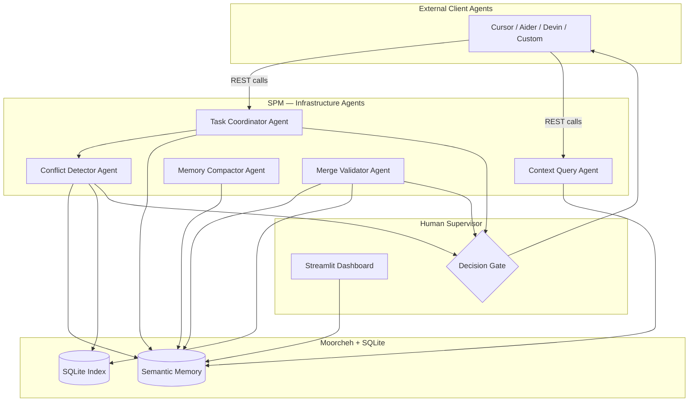
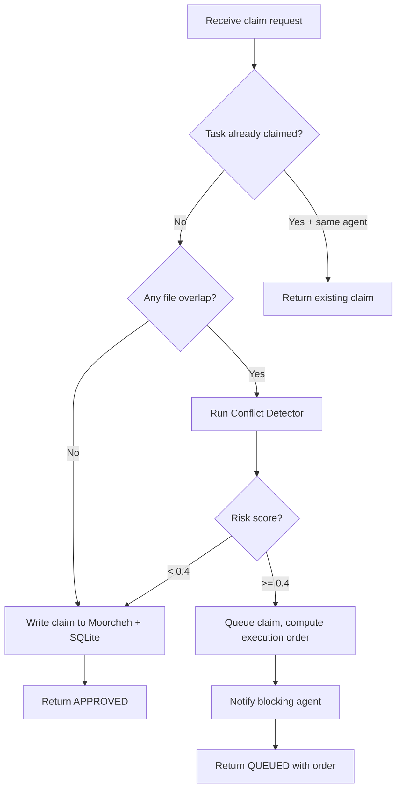
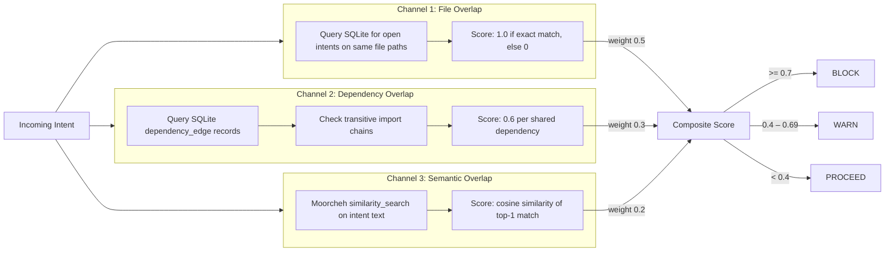
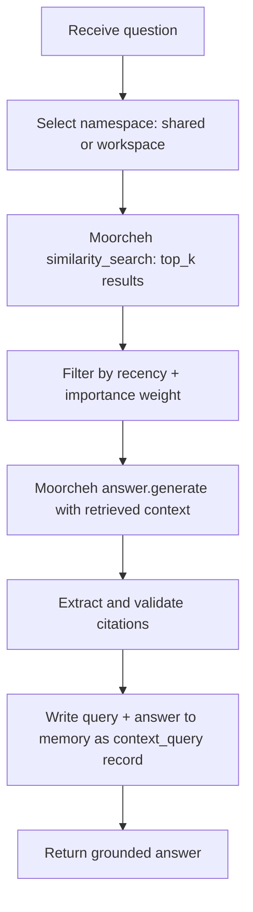
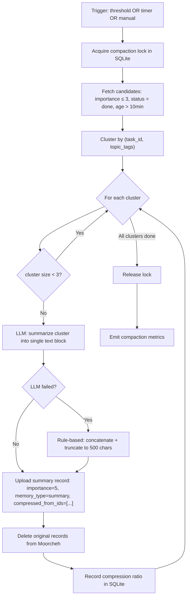
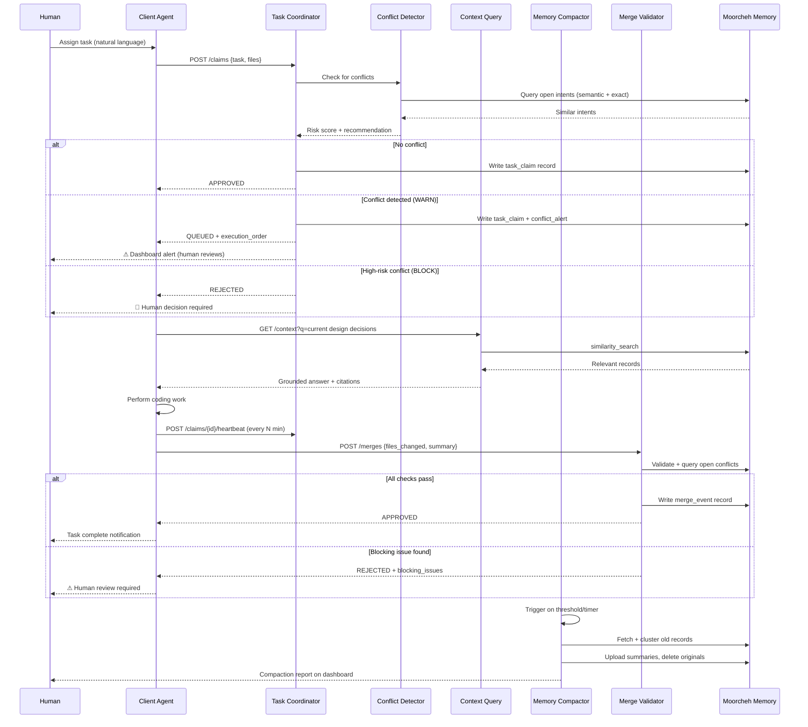
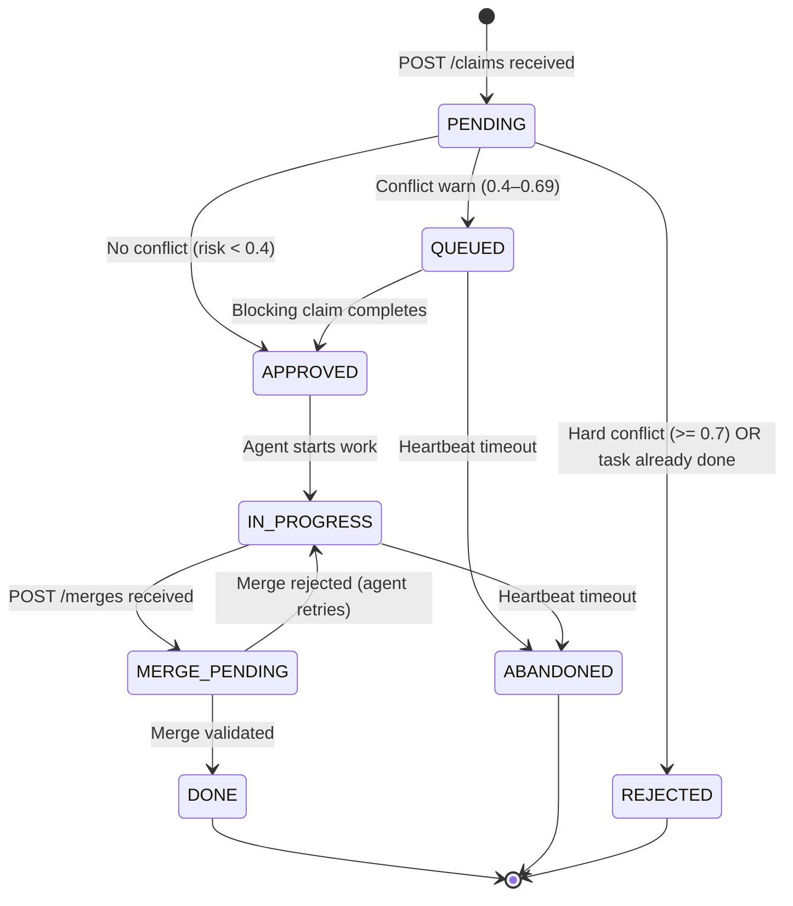
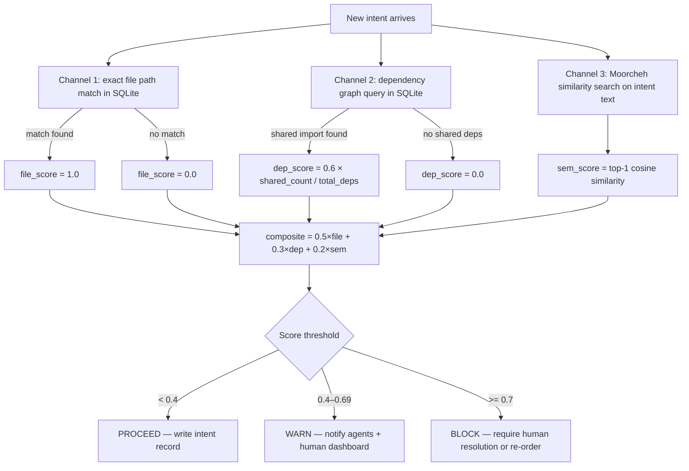
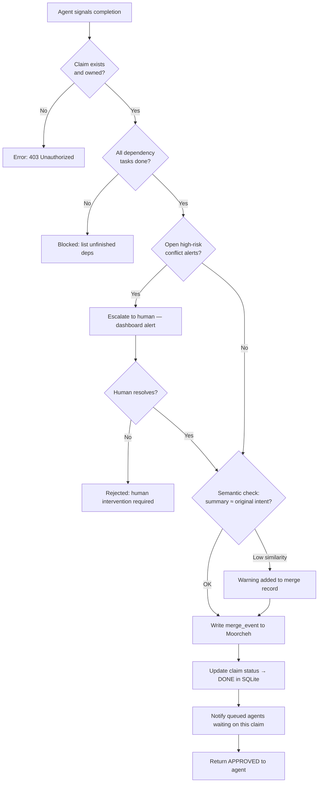

# Agent Design & Workflow Structure

This document covers the full agent architecture for the **Shared Project Memory (SPM)** system, including detailed agent profiles, end-to-end workflow design, human-in-the-loop checkpoints, deployment locations, and practical building advice.

---

## Table of Contents

1. [System Overview](#1-system-overview)
2. [Agent Taxonomy](#2-agent-taxonomy)
3. [Detailed Agent Profiles](#3-detailed-agent-profiles)
   - 3.1 [Task Coordinator Agent](#31-task-coordinator-agent)
   - 3.2 [Conflict Detector Agent](#32-conflict-detector-agent)
   - 3.3 [Context Query Agent](#33-context-query-agent)
   - 3.4 [Memory Compactor Agent](#34-memory-compactor-agent)
   - 3.5 [Merge Validator Agent](#35-merge-validator-agent)
   - 3.6 [Client Coding Agents (External)](#36-client-coding-agents-external)
4. [Workflow Structure](#4-workflow-structure)
   - 4.1 [High-Level End-to-End Flow](#41-high-level-end-to-end-flow)
   - 4.2 [Task Claim Workflow](#42-task-claim-workflow)
   - 4.3 [Conflict Detection Workflow](#43-conflict-detection-workflow)
   - 4.4 [Memory Compaction Workflow](#44-memory-compaction-workflow)
   - 4.5 [Merge & Handoff Workflow](#45-merge--handoff-workflow)
5. [Human-in-the-Loop Checkpoints](#5-human-in-the-loop-checkpoints)
6. [Agent Location Map](#6-agent-location-map)
7. [Inter-Agent Communication Protocols](#7-inter-agent-communication-protocols)
8. [Building Advice](#8-building-advice)
9. [Software Walkthrough: How Agent Workflow Creation Works](#9-software-walkthrough-how-agent-workflow-creation-works)
10. [Open Questions & Next Steps](#10-open-questions--next-steps)

---

## 1. System Overview

The SPM system is middleware that sits between **any number of autonomous coding agents** (Cursor, Devin, Aider, custom LLM loops) and the shared project repository/filesystem. It provides:

- A **semantic memory plane** (Moorcheh) that every agent reads from and writes to.
- A **coordination protocol** that prevents two agents from destructively overlapping on the same task.
- A **conflict detection layer** that scores risk before work begins.
- A **compaction engine** that keeps memory lean and retrieval fast as the session grows.
- A **dashboard** that makes the entire system observable to a human supervisor.

The agents inside SPM are *infrastructure agents* — they serve other agents. The agents outside SPM are *client agents* — they do the actual coding work.



---

## 2. Agent Taxonomy

| Agent | Type | Trigger | Output |
|---|---|---|---|
| **Task Coordinator** | Infrastructure (reactive) | REST `POST /claims` | Approved / queued / rejected claim |
| **Conflict Detector** | Infrastructure (reactive) | New file-change intent | Risk score + recommendation |
| **Context Query** | Infrastructure (reactive) | REST `GET /context` | Grounded semantic answer |
| **Memory Compactor** | Infrastructure (periodic) | Timer / event threshold | Compressed memory state |
| **Merge Validator** | Infrastructure (reactive) | REST `POST /merges` | Merge approval or rejection report |
| **Client Coding Agent** | External (autonomous) | User command / CI trigger | Code changes, test runs, PRs |

---

## 3. Detailed Agent Profiles

### 3.1 Task Coordinator Agent

**Purpose:** The single source of truth for *who is doing what*. Prevents two agents from claiming the same logical task concurrently.

**Location:** `src/core/coordination.py`, called by `src/api/server.py`

**Inputs:**
- `agent_id` — the identifier of the requesting agent
- `task_description` — natural-language description of the work to be done
- `files_affected` — list of file paths the agent plans to touch
- `estimated_duration_minutes` — optional hint for scheduling

**Outputs:**
- `status: approved` — agent may proceed immediately
- `status: queued` — a conflicting claim exists; agent must wait
- `status: rejected` — task is already done or out of scope
- `execution_order` — ordered list of claims for agents to follow
- `blocking_claim_id` — the claim the agent must wait for (if queued)

**Internal Logic:**



**Key Design Decisions:**
- Claims are persisted immediately to Moorcheh (record_type: `task_claim`) so any crash-recovery can resume from stored state.
- The `execution_order` is recomputed on every new claim to maintain global consistency — not just pairwise.
- A claim expires after `2 × estimated_duration_minutes` with no heartbeat — the agent must send `POST /claims/{id}/heartbeat` to renew it.
- Stale claims are automatically moved to `status: abandoned` by the compactor.

**Advice for Building:**
- Keep this agent *stateless* — all state lives in Moorcheh/SQLite. This makes horizontal scaling trivial and simplifies crash recovery.
- Implement claim heartbeats from day one; stale claim accumulation is the most common source of coordination bugs.
- Use an optimistic locking pattern: write the claim first, then check for conflicts and roll back if needed. This is faster than a pre-check under contention.

---

### 3.2 Conflict Detector Agent

**Purpose:** Scores the risk that a proposed file-change intent will collide with in-progress work. Produces a composite risk score from three independent channels.

**Location:** `src/core/conflict.py`, called by Coordinator and directly by client agents via `POST /intents`

**Inputs:**
- `agent_id`
- `task_id` — the owning claim
- `intent_description` — natural-language statement of what change will be made
- `files_affected` — list of target file paths
- `dependency_edges` — optional list of `(importer, importee)` pairs

**Outputs:**
- `risk_score: float` — composite 0.0–1.0
- `risk_breakdown` — per-channel scores and evidence
- `recommendation: PROCEED | WARN | BLOCK`
- `conflicting_intents` — list of overlapping intent record IDs
- `suggested_order` — recommended execution order if WARN/BLOCK

**Three-Channel Detection:**



**Advice for Building:**
- Start with Channel 1 (file overlap via SQLite) — it is fast, deterministic, and catches 80% of real conflicts.
- Add Channel 3 (semantic) second because Moorcheh handles it with a single SDK call.
- Add Channel 2 (dependency graph) last; parsing import chains is language-specific and complex.
- Make the weights configurable via `config.py` — project types (monorepo vs. microservices) will have very different optimal weights.
- Persist every conflict alert as a `conflict_alert` memory record even when the risk is LOW. These records power the compaction narrative and the demo metrics.

---

### 3.3 Context Query Agent

**Purpose:** Answers ad-hoc natural-language questions from any agent or human about the current project state, past decisions, and active plans — with citations.

**Location:** `src/core/` (thin wrapper), called via `GET /context?q=...`

**Inputs:**
- `question: str` — free-form natural-language question
- `agent_id` — for personalizing context (which tasks is this agent working on?)
- `workspace_id` — shared or branch-specific namespace to query
- `top_k: int` — max number of source records to cite (default: 5)

**Outputs:**
- `answer: str` — synthesized natural-language response
- `citations` — list of `{record_id, record_type, timestamp, relevance_score}` objects
- `grounded: bool` — True if citations are present and verified
- `latency_ms: int`

**Internal Logic:**



**Advice for Building:**
- Always pass `top_k=5` or fewer — larger retrieval budgets make answers longer but not more accurate, and they slow down Moorcheh calls.
- The `grounded: bool` flag is a first-class metric. Log every un-grounded answer (citation list is empty) — this indicates either a coverage gap in memory or a poorly formed question.
- Implement a query cache (TTL=60s, keyed on question hash + workspace_id) to avoid redundant Moorcheh calls when multiple agents ask similar questions within seconds.
- Write every query + answer back to Moorcheh as a `context_query` record. Future compaction can use these to identify frequently-asked questions and ensure their answers are captured in summaries.

---

### 3.4 Memory Compactor Agent

**Purpose:** Periodically collapses old, low-importance memory records into concise summaries, reducing storage cost and improving retrieval signal-to-noise ratio.

**Location:** `src/core/compactor.py`, runs as a background thread/async task

**Trigger Conditions (any of):**
- A configurable event threshold is crossed (default: 50 new records since last compaction).
- A configurable time interval elapses (default: every 30 minutes).
- An operator manually calls `POST /admin/compact`.

**Inputs (read from Moorcheh/SQLite):**
- All records where `importance <= 3` AND `status = done` AND `age > 10 minutes`

**Outputs:**
- New `summary` records uploaded to Moorcheh
- Original records deleted from Moorcheh
- Compaction log entry written to SQLite (chars_before, chars_after, ratio, timestamp)

**Compaction Loop:**



**What Is Never Compacted:**
- `record_type = decision` (architecture decisions are permanent)
- `record_type = conflict_alert` with `risk_score >= 0.7` (high-risk events are auditable forever)
- `importance >= 4` (any high-importance record)
- Records with `status != done` (in-progress work stays visible)

**Advice for Building:**
- Build the rule-based fallback summarizer first (truncate + join). Only add the LLM summarizer once the loop is working end-to-end.
- The compaction lock prevents concurrent runs. Use a single row in SQLite (`compaction_lock` table, `locked_at` timestamp). If `locked_at` is more than 5 minutes old, treat as stale and steal the lock.
- Log `compressed_from_ids` in every summary — this is your audit trail and the centerpiece of the demo narrative.
- Target 5–10x application-layer compression on top of Moorcheh's 32x storage compression. Anything above 3x is impressive in the demo.

---

### 3.5 Merge Validator Agent

**Purpose:** When a client agent signals it has completed a task, validates that the completed work is safe to merge into the shared workspace — checking for outstanding conflicts, incomplete dependent tasks, and semantic consistency.

**Location:** `src/core/coordination.py` (merge section), called via `POST /merges`

**Inputs:**
- `agent_id`
- `task_id` — the claim being completed
- `files_changed` — list of files actually modified
- `summary` — natural-language description of what was done

**Outputs:**
- `approved: bool`
- `blocking_issues` — list of human-readable issues preventing merge
- `warnings` — non-blocking concerns
- `merge_record_id` — the ID of the `merge_event` record written to memory

**Validation Checks (in order):**

| Check | Method | Blocking? |
|---|---|---|
| Claim exists and is owned by this agent | SQLite lookup | Yes |
| All dependency tasks are `done` | SQLite dependency_edge query | Yes |
| No open high-risk conflict alerts against this task | SQLite + Moorcheh query | Yes |
| Files actually changed match files declared in claim | Diff (if git context available) | Warning only |
| Semantic consistency: summary matches original task intent | Moorcheh similarity check | Warning only |

**Advice for Building:**
- The merge validator is the last safety net before code enters the shared workspace. Treat blocking checks as hard failures — return HTTP 409 and require human resolution.
- Write a `merge_event` record to memory *regardless* of approval status. Both approved and rejected merges are valuable signals for the compactor and the dashboard.
- If file-diff validation is too complex for the hackathon scope, stub it out — the semantic consistency check via Moorcheh is more impressive for judges and easier to implement.

---

### 3.6 Client Coding Agents (External)

These are the agents that actually write code. They are *users* of the SPM system, not part of it. They can be any agent framework that can make HTTP calls.

**Examples:** Cursor background agent, Devin, Aider, a custom LLM loop in LangChain/LangGraph, GitHub Copilot Workspace.

**What they need to do to integrate with SPM:**
1. `POST /claims` at the start of every task to register intent.
2. `POST /intents` before touching each file to run conflict detection.
3. `GET /context?q=<question>` when they need project history or decisions.
4. `POST /claims/{id}/heartbeat` every N minutes to keep claim alive.
5. `POST /merges` when the task is complete.

**Minimal integration example (Python pseudocode):**

```python
import httpx

SPM_BASE = "http://localhost:8000"

# 1. Claim the task
claim = httpx.post(f"{SPM_BASE}/claims", json={
    "agent_id": "agent-a",
    "task_description": "Refactor login module to use JWT",
    "files_affected": ["auth/login.py", "auth/session.py"]
}).json()

if claim["status"] == "queued":
    # Wait for blocking_claim_id to complete, then retry
    pass

# 2. Before touching each file, announce intent
intent = httpx.post(f"{SPM_BASE}/intents", json={
    "agent_id": "agent-a",
    "task_id": claim["claim_id"],
    "intent_description": "Replace password hash in login.py with JWT issuance",
    "files_affected": ["auth/login.py"]
}).json()

if intent["recommendation"] == "BLOCK":
    # Surface to human or pause until conflict resolves
    pass

# 3. Query context as needed
ctx = httpx.get(f"{SPM_BASE}/context", params={
    "q": "What authentication approach did we decide on?",
    "agent_id": "agent-a"
}).json()

# 4. Complete
httpx.post(f"{SPM_BASE}/merges", json={
    "agent_id": "agent-a",
    "task_id": claim["claim_id"],
    "files_changed": ["auth/login.py", "auth/session.py"],
    "summary": "Replaced bcrypt auth with JWT issuance and validation"
})
```

---

## 4. Workflow Structure

### 4.1 High-Level End-to-End Flow



---

### 4.2 Task Claim Workflow



---

### 4.3 Conflict Detection Workflow



---

### 4.4 Memory Compaction Workflow

```mermaid
gantt
    title Memory Lifecycle (per session)
    dateFormat  HH:mm
    axisFormat  %H:%M

    section Raw Events
    Task claims written        : 00:00, 30m
    File intents written       : 00:05, 45m
    Conflict alerts            : 00:10, 20m
    Decision records           : 00:15, 5m

    section First Compaction
    Trigger at 50-record threshold : milestone, 00:30, 0m
    Cluster + summarize            : 00:30, 10m
    Upload summaries               : 00:40, 5m
    Delete raw records             : 00:45, 3m

    section Post-Compaction
    New events continue            : 00:48, 42m
    Second compaction (timer)      : milestone, 01:30, 0m
```



---

### 4.5 Merge & Handoff Workflow



---

## 5. Human-in-the-Loop Checkpoints

Fully automated agent systems fail when edge cases arise. The following table lists every point in the SPM workflow where a human should be able to intervene, why it matters, and what the default automated behaviour is if no human responds.

| # | Trigger | Why Human Input Matters | Default Automated Behaviour | UI Location |
|---|---|---|---|---|
| **HITL-1** | Conflict risk score ≥ 0.7 (BLOCK) | Two agents want to change the same file in fundamentally incompatible ways. LLM cannot safely resolve this without understanding intent. | Reject the incoming claim. Queued claim stays QUEUED. | Dashboard: "Blocked Claims" panel — red badge |
| **HITL-2** | Conflict risk 0.4–0.69 (WARN) with two senior agents claiming the same module | Automated ordering may be wrong for business reasons (e.g., security-first policy, API stability). | Auto-order by claim timestamp (first come first served). | Dashboard: "Conflict Warnings" panel — amber badge |
| **HITL-3** | Merge validator rejects due to open conflict alert | Agent claims to be done but conflict is unresolved. | Block merge; notify requesting agent. | Dashboard: "Merge Queue" panel — blocked entry |
| **HITL-4** | Claim heartbeat timeout — agent appears to have crashed | The claim is holding a lock that another agent needs. Auto-abandon may lose real in-progress work. | Mark claim as ABANDONED after 2× estimated duration + no heartbeat. | Dashboard: "Stale Claims" panel — timeout warning |
| **HITL-5** | Memory compaction: LLM summarizer confidence < threshold | Low-confidence summaries may omit critical decisions. | Fall back to rule-based summarizer (concatenate + truncate). Log for human review. | Dashboard: "Compaction Log" panel — low-confidence flag |
| **HITL-6** | Agent queries context and receives `grounded: false` answer | The system doesn't know the answer — a human may need to add a decision record manually. | Return answer with explicit `"Note: not grounded in stored memory"`. | Dashboard: "Query Console" — ungrounded query log |
| **HITL-7** | >3 agents contending for the same module simultaneously | Complex dependency chains, ordering is non-trivial. | Queue all; surface to human with dependency graph visualization. | Dashboard: "Execution Order" panel |

### Implementing HITL in the Dashboard

```python
# src/ui/app.py — HITL alert rendering
def render_hitl_alerts(db, store):
    blocks = db.query("SELECT * FROM claims WHERE status='blocked' ORDER BY created_at DESC")
    if blocks:
        st.error(f"🚨 {len(blocks)} claim(s) require human decision")
        for claim in blocks:
            with st.expander(f"[BLOCK] {claim['task_description']} — {claim['agent_id']}"):
                col1, col2 = st.columns(2)
                with col1:
                    st.json(claim['conflict_details'])
                with col2:
                    if st.button("Force Approve", key=f"approve_{claim['id']}"):
                        db.update_claim_status(claim['id'], 'approved')
                        st.rerun()
                    if st.button("Reject Permanently", key=f"reject_{claim['id']}"):
                        db.update_claim_status(claim['id'], 'rejected')
                        st.rerun()
```

---

## 6. Agent Location Map

This describes *where* each component runs — both logically and physically.

```
┌─────────────────────────────────────────────────────────────┐
│                   Developer Machine / CI Server             │
│                                                             │
│  ┌──────────────┐   ┌──────────────┐   ┌──────────────┐   │
│  │ Client Agent │   │ Client Agent │   │ Client Agent │   │
│  │  (Cursor/    │   │  (Aider/     │   │  (Custom     │   │
│  │   Devin)     │   │   LangChain) │   │   Script)    │   │
│  └──────┬───────┘   └──────┬───────┘   └──────┬───────┘   │
│         │                  │                   │           │
│         └──────────────────┼───────────────────┘           │
│                            │ HTTP (localhost or LAN)        │
│         ┌──────────────────▼──────────────────────────┐    │
│         │           SPM Service (Docker)              │    │
│         │                                             │    │
│         │  ┌─────────────────────────────────────┐   │    │
│         │  │         FastAPI Server :8000         │   │    │
│         │  │  ┌──────────┐  ┌──────────────────┐ │   │    │
│         │  │  │  Task    │  │   Conflict       │ │   │    │
│         │  │  │Coordinator│  │   Detector       │ │   │    │
│         │  │  └──────────┘  └──────────────────┘ │   │    │
│         │  │  ┌──────────┐  ┌──────────────────┐ │   │    │
│         │  │  │ Context  │  │  Merge Validator  │ │   │    │
│         │  │  │  Query   │  │                  │ │   │    │
│         │  │  └──────────┘  └──────────────────┘ │   │    │
│         │  └─────────────────────────────────────┘   │    │
│         │                                             │    │
│         │  ┌─────────────────────────────────────┐   │    │
│         │  │    Memory Compactor (background)     │   │    │
│         │  └─────────────────────────────────────┘   │    │
│         │                                             │    │
│         │  ┌──────────────────┐                       │    │
│         │  │  SQLite :file    │  (local filesystem)   │    │
│         │  └──────────────────┘                       │    │
│         └─────────────────────┬───────────────────────┘    │
│                               │                             │
│  ┌────────────────────────────▼──────────────────────┐     │
│  │         Streamlit Dashboard :8501                  │     │
│  │  (Human supervisor's browser interface)            │     │
│  └────────────────────────────────────────────────────┘     │
└─────────────────────────────────────────────────────────────┘
                               │
                               │ HTTPS (Moorcheh SDK)
                               ▼
                  ┌─────────────────────────┐
                  │   Moorcheh Cloud API    │
                  │  (Semantic Memory Host) │
                  └─────────────────────────┘
```

**Network boundaries:**
- Client agents → SPM: HTTP on localhost (single-machine setup) or LAN (multi-machine setup).
- SPM → Moorcheh: HTTPS to Moorcheh cloud API. This is the only external network call.
- SPM → SQLite: Local file I/O (no network).
- Human → Dashboard: Browser to `localhost:8501`.

**Docker Compose layout:**

```yaml
services:
  spm-api:
    build: .
    ports: ["8000:8000"]
    volumes:
      - spm-data:/app/data   # SQLite file lives here
    environment:
      - MOORCHEH_API_KEY=${MOORCHEH_API_KEY}

  spm-dashboard:
    build: .
    command: streamlit run src/ui/app.py
    ports: ["8501:8501"]
    depends_on: [spm-api]
    environment:
      - SPM_API_URL=http://spm-api:8000

volumes:
  spm-data:
```

---

## 7. Inter-Agent Communication Protocols

### REST API Contract (SPM Infrastructure)

| Endpoint | Method | Description |
|---|---|---|
| `/claims` | POST | Register a new task claim |
| `/claims/{id}` | GET | Get claim status and details |
| `/claims/{id}` | DELETE | Release a claim (abandon) |
| `/claims/{id}/heartbeat` | POST | Renew a claim's TTL |
| `/intents` | POST | Register a file-change intent, run conflict detection |
| `/intents/{id}` | GET | Get intent details and risk score |
| `/context` | GET | Query project memory (semantic search + grounded answer) |
| `/merges` | POST | Signal task completion, trigger merge validation |
| `/merges/{id}` | GET | Get merge record details |
| `/decisions` | POST | Write an architecture decision record to memory |
| `/conflicts` | GET | List all open conflict alerts |
| `/admin/compact` | POST | Manually trigger memory compaction |
| `/admin/stats` | GET | Return memory stats (doc count, compression ratio, latency) |
| `/health` | GET | Health check (Moorcheh connectivity, SQLite status) |

### Event Flow Conventions

- All agent identifiers are free-form strings — SPM does not manage agent registration. Any string is a valid `agent_id`.
- All timestamps are ISO 8601 UTC.
- All REST calls return HTTP 200/201 on success, 4xx on client error, 503 if Moorcheh is unreachable (with fallback indicator in response body).
- Agents should implement exponential backoff with jitter on 503 responses.

### Memory Record Routing

```
record_type          → primary namespace       → SQLite table
─────────────────────────────────────────────────────────────
task_claim           → spm-{proj}-shared       → claims
file_change_intent   → spm-{proj}-ws-{branch}  → intents
dependency_edge      → spm-{proj}-shared       → deps
conflict_alert       → spm-{proj}-shared       → conflicts
decision             → spm-{proj}-shared       → decisions
merge_event          → spm-{proj}-shared       → merges
context_query        → spm-{proj}-shared       → queries
summary              → spm-{proj}-shared       → (Moorcheh only)
```

---

## 8. Building Advice

### Sequencing (What to Build First)

Follow this order to maximize demo value per hour of effort:

```
Hour 0–2:   config.py + .env.example + directory skeleton
Hour 2–4:   memory/schemas.py + memory/store.py (Moorcheh wrapper + JSON fallback)
Hour 4–6:   memory/index.py (SQLite) + basic write/read tests
Hour 6–8:   core/conflict.py Channel 1 only (file overlap, SQLite)
Hour 8–10:  api/server.py skeleton + /claims + /health endpoints
Hour 10–12: core/coordination.py (claim + queue + heartbeat)
Hour 12–14: core/conflict.py Channel 3 (semantic, Moorcheh)
Hour 14–16: api/server.py /intents + /context endpoints
Hour 16–18: core/compactor.py (rule-based summarizer first, LLM second)
Hour 18–22: ui/app.py (Streamlit dashboard + HITL panels)
Hour 22–26: scripts/ingest_demo.py + scripts/run_demo.py
Hour 26–28: metrics/collector.py + dashboard metrics panels
Hour 28–30: Docker packaging + README + integration tests
Hour 30–32: scripts/benchmark.py + demo rehearsal
Hour 32–36: Polish, edge-case fixes, presentation prep
```

### Anti-Patterns to Avoid

1. **Don't store state in agent memory (in-process variables).** The moment you do, horizontal scaling and crash recovery become impossible. Every bit of state lives in Moorcheh or SQLite.

2. **Don't query Moorcheh without a `top_k` cap.** Uncapped similarity searches return unbounded context, which destroys LLM answer quality and increases latency unpredictably.

3. **Don't skip the JSON fallback.** The Moorcheh API will be unreachable at least once during the hackathon. Without a local fallback, your demo dies. The fallback is < 50 lines of code.

4. **Don't make agents call Moorcheh directly.** All memory access must go through `memory/store.py`. This is what allows you to swap fallback modes, inject metrics, and batch writes transparently.

5. **Don't build Channel 2 (dependency graph) before your demo is working end-to-end.** It is the most complex channel and the least impactful for the demo. Build it last if at all.

6. **Don't poll — use claim queues.** Client agents waiting for a blocked claim should poll `/claims/{id}` with exponential backoff (start at 2s, max at 30s). SPM should not push notifications — that requires WebSockets and adds complexity.

### Testing Strategy

```
tests/
  conftest.py          # MockMoorchehClient that records all calls + returns fixtures
  test_store.py        # write/read/search/delete with mock client
  test_coordination.py # claim → queue → approve flow (no network needed)
  test_conflict.py     # risk score computation for all three channels
  test_compactor.py    # cluster + summarize + delete cycle
  test_api.py          # FastAPI TestClient integration (all endpoints)
```

The `MockMoorchehClient` is the single most important test infrastructure piece. Build it before anything else so every subsequent test is fast and deterministic:

```python
# tests/conftest.py
class MockMoorchehClient:
    def __init__(self):
        self._docs: dict[str, list[dict]] = {}  # namespace → [doc]

    def upload(self, namespace, docs):
        self._docs.setdefault(namespace, []).extend(docs)
        return [{"id": d["id"], "status": "ok"} for d in docs]

    def similarity_search(self, namespace, query, top_k=5):
        # Return first top_k docs (good enough for tests)
        return self._docs.get(namespace, [])[:top_k]

    def answer_generate(self, namespace, question, top_k=5):
        docs = self.similarity_search(namespace, question, top_k)
        return {
            "answer": f"Mock answer to: {question}",
            "citations": [d["id"] for d in docs],
            "grounded": bool(docs)
        }

    def delete(self, namespace, doc_ids):
        if namespace in self._docs:
            self._docs[namespace] = [d for d in self._docs[namespace] if d["id"] not in doc_ids]
```

### Configuration Reference

All configuration via environment variables (`.env` file or Docker env):

```bash
# Required
MOORCHEH_API_KEY=<your_key>
PROJECT_ID=myproject

# Optional with sensible defaults
SPM_PORT=8000
DASHBOARD_PORT=8501
SQLITE_PATH=./data/spm.db
JSON_FALLBACK_PATH=./data/fallback.json
COMPACTION_THRESHOLD=50
COMPACTION_INTERVAL_MINUTES=30
CLAIM_TTL_MULTIPLIER=2
TOP_K_RETRIEVAL=5
CONFLICT_FILE_WEIGHT=0.5
CONFLICT_DEP_WEIGHT=0.3
CONFLICT_SEM_WEIGHT=0.2
CONFLICT_WARN_THRESHOLD=0.4
CONFLICT_BLOCK_THRESHOLD=0.7
LLM_PROVIDER=openai       # or "anthropic" or "none" for rule-based only
LLM_MODEL=gpt-4o-mini
OPENAI_API_KEY=<optional>
LOG_LEVEL=INFO
LOG_FORMAT=json           # or "text" for development
```

---

## 9. Software Walkthrough: How Agent Workflow Creation Works

This section explains the full lifecycle of how an operator creates, configures, and runs a multi-agent workflow using the SPM system.

### Step 1: Bootstrap the Project

```bash
# Clone + install
git clone <repo> && cd spm
pip install -r requirements.txt

# Configure
cp .env.example .env
# Edit .env: set MOORCHEH_API_KEY and PROJECT_ID

# Start services
docker-compose up -d
# OR
uvicorn src.main:app --port 8000 &
streamlit run src/ui/app.py --server.port 8501 &
```

At startup, `src/main.py` runs:
1. Load config from `.env`
2. Initialize Moorcheh client (or JSON fallback if API unreachable)
3. Ensure Moorcheh namespaces exist (`spm-{PROJECT_ID}-shared`, etc.)
4. Initialize SQLite schema (create tables if not exists)
5. Start background compactor thread
6. Start FastAPI server

### Step 2: Define the Workflow (Agent Assignment)

The operator assigns tasks to agents using natural language. This can be done via:

**Option A: Scripted (demo mode)**
```python
# scripts/ingest_demo.py
agents = [
    {"id": "agent-a", "task": "Refactor login module to use JWT", "files": ["auth/login.py", "auth/session.py"]},
    {"id": "agent-b", "task": "Optimize session DB queries",       "files": ["db/session.py", "auth/session.py"]},
    {"id": "agent-c", "task": "Add rate limiting to auth API",     "files": ["api/auth.py"]},
]
for agent in agents:
    requests.post("http://localhost:8000/claims", json={
        "agent_id": agent["id"],
        "task_description": agent["task"],
        "files_affected": agent["files"]
    })
```

**Option B: Live (production mode)**
Each client agent calls `POST /claims` autonomously as it receives tasks from its operator/user.

**Option C: Dashboard (human-driven)**
The Streamlit dashboard's "Create Task" form lets a human manually register a claim and assign it to an agent ID.

### Step 3: SPM Processes Claims and Detects Conflicts

As claims arrive, the coordination and conflict engines run automatically:

- `agent-a` claims `auth/session.py` → **APPROVED**
- `agent-b` claims `auth/session.py` → **QUEUED** (file overlap with agent-a, risk 0.85)
  - Dashboard shows conflict alert with risk breakdown
  - Human can see: "agent-a owns session.py, agent-b must wait"
- `agent-c` claims `api/auth.py` → **APPROVED** (no overlap)

### Step 4: Agents Execute in Coordination

```
Timeline:
t=0:  agent-a starts (APPROVED)
t=0:  agent-c starts (APPROVED)
t=0:  agent-b waits (QUEUED)
t=25: agent-a calls POST /merges → validated → DONE
t=25: SPM notifies agent-b: "claim now unblocked"
t=25: agent-b starts (APPROVED)
t=40: agent-c calls POST /merges → validated → DONE
t=55: agent-b calls POST /merges → validated → DONE
```

### Step 5: Agents Query Context Throughout

At any point, an agent can ask:
```
GET /context?q=What authentication approach did we decide on?&agent_id=agent-b
```
SPM queries Moorcheh for records related to authentication decisions and returns a grounded answer. This prevents agents from re-litigating decisions already made by other agents.

### Step 6: Memory Compacts Automatically

After 50 events (or 30 minutes), the compactor runs:
- Groups old `task_claim` and `file_change_intent` records by task
- Summarizes each group into a single `summary` record
- Deletes originals
- Dashboard shows: "Compression: 47 raw records → 8 summaries (5.9x)"

### Step 7: Dashboard Provides Full Observability

The human supervisor sees:
- **Claims board**: Kanban-style view of all active/queued/done claims
- **Conflict log**: Every conflict alert with risk scores and resolution
- **Memory stats**: Doc count, compression ratio, namespace sizes
- **Query console**: Ad-hoc natural-language queries against project memory
- **Latency histogram**: P50/P95 Moorcheh retrieval latency
- **HITL queue**: Any claim requiring human decision

### Step 8: Post-Session Analysis

```bash
python scripts/benchmark.py --session-id session-2026-03-14
```
Outputs:
- Total claims processed
- Conflict prevention rate (claims that would have collided without SPM)
- Compression ratio achieved
- Average retrieval latency
- Grounding rate (fraction of answered queries with valid citations)

---

## 10. Open Questions & Next Steps

| Question | Priority | Notes |
|---|---|---|
| Should claim heartbeats be agent-initiated (poll) or SPM-initiated (push via WebSocket)? | Medium | Pull is simpler for MVP; push is better UX |
| Should the conflict detector support custom weight profiles per project type? | Low | Add to config.py as `CONFLICT_PROFILE=monorepo` etc. |
| Should SPM support multi-project namespacing in a single deployment? | Low | Namespace isolation already supports this; just add project routing |
| What is the maximum number of concurrent agents tested? | High | Benchmark target: 10 agents, < 200ms claim latency at P95 |
| Should decision records be writable only by humans (not agents)? | Medium | Prevents agents from overwriting human architectural decisions |
| How does SPM handle a client agent that never calls POST /merges? | High | Heartbeat timeout → ABANDONED; covered in HITL-4 |
