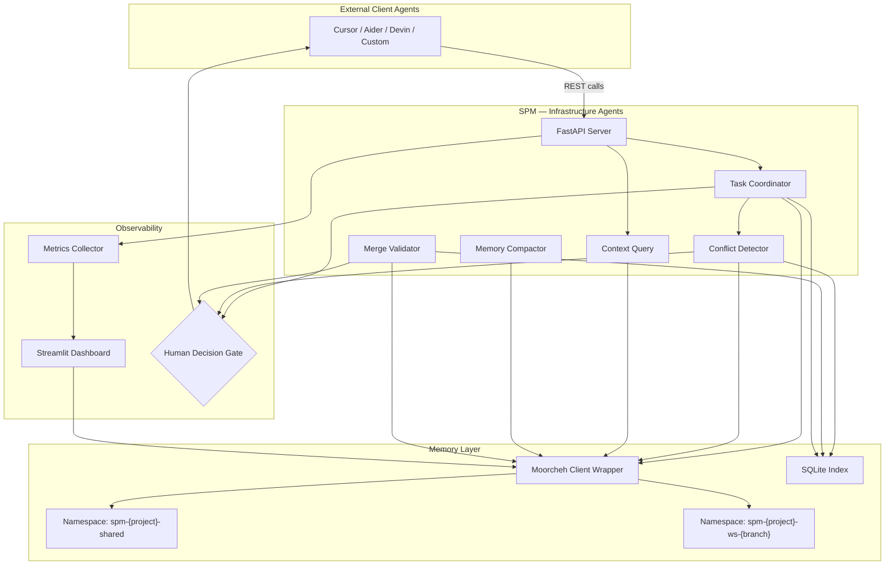
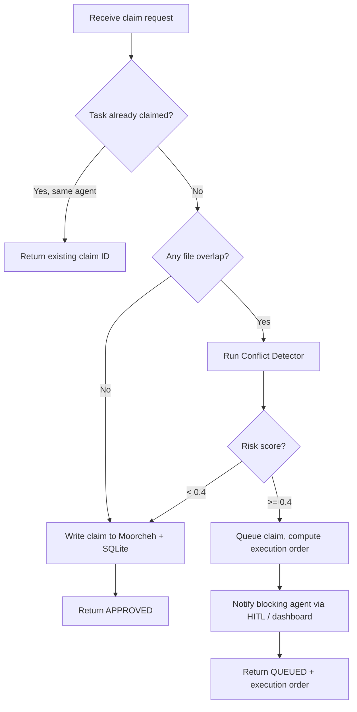
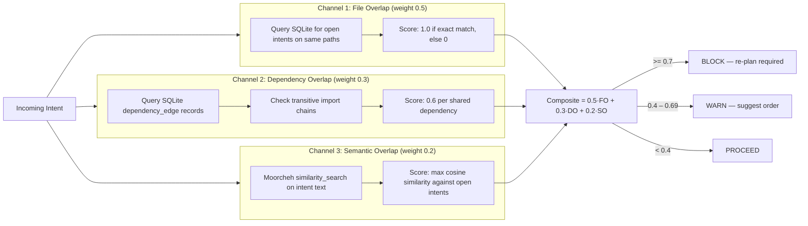
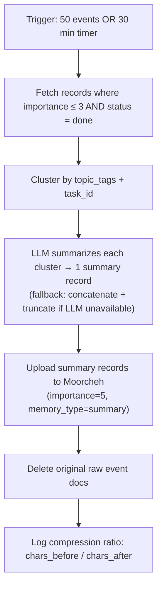
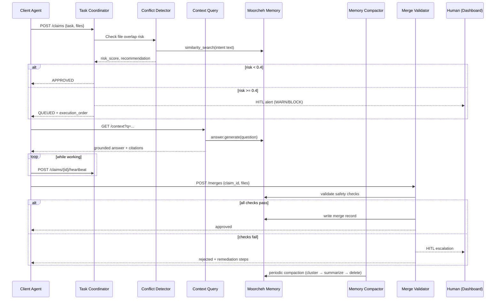

# Shared Project Memory (SPM) — Full Technical Plan

> For a quick orientation see [`OVERVIEW.md`](./OVERVIEW.md) first.

---

## Table of Contents

1. [Project Goal](#1-project-goal)
2. [Architecture](#2-architecture)
3. [Agent Structure](#3-agent-structure)
   - 3.1 [Task Coordinator](#31-task-coordinator)
   - 3.2 [Conflict Detector](#32-conflict-detector)
   - 3.3 [Context Query](#33-context-query)
   - 3.4 [Memory Compactor](#34-memory-compactor)
   - 3.5 [Merge Validator](#35-merge-validator)
   - 3.6 [Client Coding Agents (External)](#36-client-coding-agents-external)
4. [End-to-End Workflow](#4-end-to-end-workflow)
5. [Human-in-the-Loop Checkpoints](#5-human-in-the-loop-checkpoints)
6. [Memory Design](#6-memory-design)
7. [Conflict Detection Algorithm](#7-conflict-detection-algorithm)
8. [Compaction Strategy](#8-compaction-strategy)
9. [API Contract](#9-api-contract)
10. [File Structure](#10-file-structure)
11. [Configuration Reference](#11-configuration-reference)
12. [36-Hour Build Schedule](#12-36-hour-build-schedule)
13. [Demo Script](#13-demo-script)
14. [Testing Strategy](#14-testing-strategy)
15. [Risk Mitigations](#15-risk-mitigations)
16. [Prize Track Arguments](#16-prize-track-arguments)

---

## 1. Project Goal

Build a **Shared Project Memory (SPM) Layer** — production-ready middleware that coordinates multiple AI coding agents through a centralized semantic memory plane powered by Moorcheh. Targets both the **Bitdeer "Beyond the Prototype"** and the **Moorcheh "Efficient Memory"** prize tracks at GenAI Genesis 2026.

---

## 2. Architecture



### Component Responsibilities

| Component | File | Role |
|---|---|---|
| **FastAPI Server** | `src/api/server.py` | REST API ingress: routes, middleware, health checks, OpenAPI docs |
| **Task Coordinator** | `src/core/coordination.py` | Claim lifecycle, execution ordering, heartbeat TTL |
| **Conflict Detector** | `src/core/conflict.py` | 3-channel risk scoring; blocks or queues risky claims |
| **Context Query** | (via `src/memory/store.py`) | Grounded answers with citation validation and query caching |
| **Memory Compactor** | `src/core/compactor.py` | Cluster → summarize → upload → delete compaction loop |
| **Merge Validator** | `src/core/merge.py` | Ordered safety checks before work enters shared workspace |
| **Moorcheh Wrapper** | `src/memory/store.py` | Namespace lifecycle, CRUD, similarity search, fallback |
| **SQLite Index** | `src/memory/index.py` | Fast exact lookups: file path, agent ID, task status, timestamp |
| **Streamlit Dashboard** | `src/ui/app.py` | Real-time observability and HITL queue |
| **Metrics Collector** | `src/metrics/collector.py` | Latency, compression ratio, grounding rate, conflict stats |

---

## 3. Agent Structure

### Agent Taxonomy

| Agent | Type | Trigger | Primary Output |
|---|---|---|---|
| **Task Coordinator** | Infrastructure / reactive | `POST /claims` | Approved / queued / rejected claim + execution order |
| **Conflict Detector** | Infrastructure / reactive | New file-change intent | Risk score + PROCEED / WARN / BLOCK recommendation |
| **Context Query** | Infrastructure / reactive | `GET /context` | Grounded semantic answer with citations |
| **Memory Compactor** | Infrastructure / periodic | Timer or event threshold | Compressed memory state |
| **Merge Validator** | Infrastructure / reactive | `POST /merges` | Merge approval or rejection report |
| **Client Coding Agent** | External / autonomous | User command or CI trigger | Code changes, test runs, PRs |

---

### 3.1 Task Coordinator

**Purpose:** Single source of truth for *who is doing what*. Prevents two agents from claiming the same logical task concurrently.

**Inputs:**
- `agent_id` — identifier of the requesting agent
- `task_description` — natural-language description of the work
- `files_affected` — list of file paths the agent plans to touch
- `estimated_duration_minutes` — optional hint for scheduling

**Outputs:**
- `status`: `approved` | `queued` | `rejected`
- `execution_order` — ordered list of claims for all agents to follow
- `blocking_claim_id` — the claim the agent must wait for (when queued)

**Internal Logic:**



**Key Design Decisions:**
- Claims are persisted immediately to Moorcheh (`record_type: task_claim`) so crash recovery can resume from stored state.
- `execution_order` is recomputed on every new claim to maintain global consistency — not just pairwise.
- A claim expires after `2 × estimated_duration_minutes` with no heartbeat (`POST /claims/{id}/heartbeat`). Stale claims move to `abandoned` automatically.
- Keep this agent **stateless** — all state lives in Moorcheh/SQLite so horizontal scaling is trivial.

---

### 3.2 Conflict Detector

**Purpose:** Scores the risk that a proposed file-change intent will collide with in-progress work. Uses three independent scoring channels combined into a single composite risk score.

**Inputs:**
- `agent_id`, `task_id`
- `intent_description` — natural-language statement of the change
- `files_affected` — list of target file paths
- `dependency_edges` — optional list of `(importer, importee)` tuples

**Outputs:**
- `risk_score: float` — composite 0.0–1.0
- `risk_breakdown` — per-channel scores and evidence
- `recommendation`: `PROCEED` | `WARN` | `BLOCK`
- `conflicting_intents` — overlapping intent record IDs
- `suggested_order` — recommended execution order when WARN or BLOCK

**Three-Channel Scoring:**



**Key Design Decision:** Moorcheh's deterministic exhaustive search (ITS scoring) is required for Channel 3. Probabilistic ANN indexes can miss semantically overlapping intents, which would silently allow conflicting work to begin.

---

### 3.3 Context Query

**Purpose:** Answers any natural-language question about the project's history, decisions, and in-flight work by querying shared memory and returning a grounded, cited answer.

**Inputs:**
- `question` — free-text query
- `agent_id` — used to scope workspace namespace
- `top_k` — maximum records to retrieve (default: 5; hard cap enforced)

**Outputs:**
- `answer` — synthesized natural-language response
- `citations` — list of memory record IDs and timestamps supporting the answer
- `grounded: bool` — false if no cited records exist (surface to HITL)

**Logic:**
1. Run `similarity_search` on `spm-{project}-shared` namespace.
2. Run `answer.generate` with retrieved records as context.
3. Validate every citation ID against SQLite (prevents hallucinated references).
4. Return answer + citations + grounding flag.
5. Cache identical queries for 60 seconds (reduce Moorcheh load during burst).

---

### 3.4 Memory Compactor

**Purpose:** Keeps the memory namespace lean as the session grows. Clusters old low-importance records by topic and summarizes each cluster into a single summary record via LLM.

**Trigger:** Every 50 new events **or** every 30 minutes (configurable).

**Logic:**



**Key Design Decisions:**
- Records with `importance = 4 or 5` (decisions, conflict resolutions) are **never** compacted — full auditability is preserved.
- Summary records store `compressed_from_ids` so provenance is always traceable.
- Compaction is **idempotent** — re-running on an already-compacted window is a no-op.
- LLM provider is configurable (`openai`, `anthropic`, or `none` for rule-based fallback).

---

### 3.5 Merge Validator

**Purpose:** Runs a sequence of safety checks before a completed task's work enters the shared workspace. Acts as the final gate in the coordination protocol.

**Trigger:** `POST /merges`

**Ordered Safety Checks:**
1. Claim status is `in_progress` (not already done, abandoned, or non-existent).
2. No open BLOCK-level conflicts remain unresolved for this claim's files.
3. All files declared in the original claim's `files_affected` list are accounted for.
4. The heartbeat was renewed within the TTL (i.e., the agent was actually alive during execution).
5. No other claim transitioned to `done` on the same files in the same window (last-writer-wins guard).

**Outputs:**
- `approved: true` + merge record written to Moorcheh.
- `rejected` with ordered list of failed checks and remediation steps.
- HITL notification if checks 2 or 5 fail (these require human judgment).

---

### 3.6 Client Coding Agents (External)

These are **not part of SPM** — they are the agents SPM serves. Any HTTP-capable agent can integrate using this minimal 5-call pattern:

```python
# 1. Register intent and get a claim
claim  = POST /claims        # { agent_id, task_description, files_affected }

# 2. Check conflict risk before touching each file
intent = POST /intents       # { agent_id, task_id, intent_description, files_affected }

# 3. Query shared memory for decisions and context
ctx    = GET  /context       # ?q=<natural language question>&agent_id=<id>

# 4. Keep-alive while working
         POST /claims/{id}/heartbeat   # every estimated_duration_minutes / 2

# 5. Signal completion and trigger merge validation
         POST /merges        # { claim_id, files_merged }
```

---

## 4. End-to-End Workflow



---

## 5. Human-in-the-Loop Checkpoints

| ID | Trigger | Automated Fallback | Dashboard Panel |
|---|---|---|---|
| HITL-1 | Conflict risk ≥ 0.7 (BLOCK) | Queue second agent; notify first | Conflict alert with risk breakdown |
| HITL-2 | Merge validation fails (check 2 or 5) | Reject merge; keep claim open | Merge rejection log |
| HITL-3 | Claim heartbeat timeout (abandoned) | Mark claim abandoned; free files | Stale claims board |
| HITL-4 | Compactor produces low-confidence summary | Keep raw records; skip deletion | Compaction review queue |
| HITL-5 | Context query returns `grounded: false` | Surface disclaimer with answer | Ungrounded query log |
| HITL-6 | More than 3 agents contending on same files | Freeze all but first; notify human | Contention alert |
| HITL-7 | Agent calls POST /merges with zero heartbeats since claim | Block merge; flag as suspicious | Agent activity log |

---

## 6. Memory Design

### Document Schema

All Moorcheh records share a common base and are differentiated by `record_type`:

```python
@dataclass
class MemoryRecord:
    id: str            # "{type}:{project}:{timestamp}:{uuid4_short}"
    record_type: str   # task_claim | plan_step | decision | file_change_intent
                       # dependency_edge | conflict_alert | merge_event | summary
    project_id: str
    workspace_id: str  # "shared" or branch name
    agent_id: str
    timestamp: str     # ISO 8601
    text: str          # natural-language summary — what Moorcheh indexes
    importance: int    # 1–5 (5 = never compact)
    status: str        # open | in_progress | done | blocked | superseded
    payload: dict      # type-specific structured fields
```

The `text` field is what Moorcheh indexes for similarity search. The `payload` dict carries typed structured data after retrieval.

### Namespace Layout

| Namespace | Content | Access |
|---|---|---|
| `spm-{project}-shared` | Decisions, conflict resolutions, merge events, summaries | All agents |
| `spm-{project}-ws-{branch}` | Task claims, file intents, plan steps for one branch | Agents on that branch |

### Dual-Index Hybrid Retrieval

| Query Type | Backend |
|---|---|
| "What decision was made about auth?" | Moorcheh (semantic similarity) |
| "All open intents for auth/login.py" | SQLite (exact path lookup) |
| "Claims filed in the last 10 minutes" | SQLite (timestamp range) |
| "Agents working on session management" | Moorcheh (semantic) |

---

## 7. Conflict Detection Algorithm

See [Section 3.2](#32-conflict-detector) for the full diagram. Weights are configurable:

```
risk = (file_overlap × CONFLICT_FILE_WEIGHT)
     + (dep_overlap  × CONFLICT_DEP_WEIGHT)
     + (sem_overlap  × CONFLICT_SEM_WEIGHT)

Defaults: 0.5 / 0.3 / 0.2  (must sum to 1.0)

PROCEED  if risk < CONFLICT_WARN_THRESHOLD    (default 0.4)
WARN     if risk < CONFLICT_BLOCK_THRESHOLD   (default 0.7)
BLOCK    if risk ≥ CONFLICT_BLOCK_THRESHOLD
```

---

## 8. Compaction Strategy

See [Section 3.4](#34-memory-compactor) for the full diagram. Two compression layers work together:

| Layer | Mechanism | Ratio |
|---|---|---|
| Moorcheh storage | MIB binarization + ITS scoring | ~32× |
| SPM application | Cluster raw events → LLM summaries | ~5–10× |

Combined effective compression: **~160–320×** vs. naive vector storage.

The compaction loop targets a memory ceiling that grows **logarithmically** with project activity instead of linearly.

---

## 9. API Contract

| Method | Endpoint | Purpose |
|---|---|---|
| `POST` | `/claims` | Register a new task claim |
| `GET` | `/claims/{id}` | Get claim status and execution order |
| `POST` | `/claims/{id}/heartbeat` | Renew claim TTL |
| `POST` | `/intents` | Register a file-change intent + get risk score |
| `GET` | `/context` | Query shared memory (natural language) |
| `POST` | `/merges` | Signal task completion + trigger merge validation |
| `GET` | `/conflicts` | List current conflict alerts |
| `GET` | `/health` | Check Moorcheh connectivity, namespace status, SQLite integrity |

All endpoints return structured JSON. Errors follow RFC 7807 (Problem Details). Full OpenAPI spec auto-generated by FastAPI at `/docs`.

---

## 10. File Structure

```
src/
  api/
    server.py          # FastAPI app, routes, middleware, CORS
    models.py          # Pydantic request/response schemas
    deps.py            # Dependency injection (store, coordination engine)
  core/
    coordination.py    # Task Coordinator: claim lifecycle, execution ordering
    conflict.py        # Conflict Detector: 3-channel risk scoring
    compactor.py       # Memory Compactor: cluster → summarize → delete
    merge.py           # Merge Validator: ordered safety checks
  memory/
    store.py           # Moorcheh client wrapper + local JSON fallback
    index.py           # SQLite index: schema, CRUD, fast lookups
    schemas.py         # MemoryRecord dataclass + per-type payload schemas
  metrics/
    collector.py       # Latency, compression ratio, grounding rate tracking
    dashboard.py       # Aggregation helpers for the Streamlit UI
  ui/
    app.py             # Streamlit dashboard
  config.py            # pydantic-settings: all config from environment
  main.py              # Entrypoint: init Moorcheh, SQLite, compactor, FastAPI
scripts/
  ingest_demo.py       # Scripted 3-agent demo scenario ingestion
  run_demo.py          # End-to-end demo runner
  benchmark.py         # Metrics measurement: latency, compression, grounding
tests/
  conftest.py          # MockMoorchehClient + shared fixtures
  test_store.py        # Memory layer: write / read / search / delete
  test_coordination.py # Claim → queue → approve / reject flows
  test_conflict.py     # Risk score computation, all three channels
  test_compactor.py    # Cluster + summarize + delete cycle
  test_api.py          # FastAPI TestClient integration (all endpoints)
requirements.txt
Dockerfile
docker-compose.yml
.env.example
README.md
docs/
  OVERVIEW.md          # High-level project summary (this file's companion)
  PLAN.md              # This document
```

---

## 11. Configuration Reference

All configuration is loaded from environment variables (`.env` file or Docker env). No hardcoded values anywhere in the codebase.

```bash
# Required
MOORCHEH_API_KEY=<your_key>
PROJECT_ID=myproject

# Server
SPM_PORT=8000
DASHBOARD_PORT=8501

# Storage
SQLITE_PATH=./data/spm.db
JSON_FALLBACK_PATH=./data/fallback.json

# Compaction
COMPACTION_THRESHOLD=50          # events before triggering
COMPACTION_INTERVAL_MINUTES=30   # time-based trigger

# Claims
CLAIM_TTL_MULTIPLIER=2           # claim expires after 2x estimated_duration

# Retrieval
TOP_K_RETRIEVAL=5                # hard cap on every Moorcheh query

# Conflict thresholds
CONFLICT_FILE_WEIGHT=0.5
CONFLICT_DEP_WEIGHT=0.3
CONFLICT_SEM_WEIGHT=0.2
CONFLICT_WARN_THRESHOLD=0.4
CONFLICT_BLOCK_THRESHOLD=0.7

# LLM for compaction summaries
LLM_PROVIDER=openai              # "anthropic" or "none" for rule-based fallback
LLM_MODEL=gpt-4o-mini
OPENAI_API_KEY=<optional>

# Observability
LOG_LEVEL=INFO
LOG_FORMAT=json                  # "text" for local development
```

---

## 12. 36-Hour Build Schedule

Build in order of **demo value**, not technical elegance. Each phase is independently demoable.

| Hours | Phase | Deliverable |
|---|---|---|
| 0–2 | Scaffolding | `requirements.txt`, `.env.example`, `config.py`, directory structure, Moorcheh SDK validation |
| 2–6 | Memory layer | `store.py` + `index.py` + `schemas.py` — read/write/query with tests |
| 6–12 | Coordination + conflict | `coordination.py` + `conflict.py` — claim flow and risk scoring with tests |
| 12–16 | API | `server.py` + `models.py` — all endpoints wired |
| 16–20 | Compaction | `compactor.py` — LLM summarization loop + rule-based fallback |
| 20–26 | Dashboard | `ui/app.py` + `metrics/` — real-time observability |
| 26–30 | Demo scripts | `ingest_demo.py` + `run_demo.py` + `benchmark.py` |
| 30–34 | Hardening | Integration tests, Docker packaging, offline fallback validation |
| 34–36 | Polish | Demo rehearsal, metrics capture, presentation prep |

**Anti-Patterns to Avoid:**
1. **Stateful infrastructure agents** — all state must live in Moorcheh/SQLite.
2. **Uncapped `top_k`** — always enforce `TOP_K_RETRIEVAL`; unbounded retrieval degrades quality.
3. **Skipping JSON fallback** — the demo environment may lose Moorcheh connectivity; fallback makes the demo resilient.
4. **Direct Moorcheh SDK calls outside `store.py`** — all Moorcheh access must go through the wrapper for consistent error handling and metrics.
5. **Building dependency-graph channel before the basic end-to-end loop works** — get Channels 1 and 3 working first, add Channel 2 only when the rest is stable.
6. **Push-based notifications in MVP** — use polling and dashboard refresh for the hackathon; WebSockets add complexity for little demo gain.

---

## 13. Demo Script

Optimized to prove all major capabilities to judges in under 10 minutes:

1. **Setup** — Show clean namespace, empty dashboard. Health check passes.
2. **Agent A** claims auth refactor (`login.py`, `session.py`). Records appear on dashboard.
3. **Agent B** proposes DB optimization touching `session.py`. Conflict Detector fires — dashboard shows risk score breakdown (file overlap + semantic overlap on "session management"). Recommendation: WARN.
4. **System** suggests execution order: A first, then B. Agent B's claim is queued.
5. **Agent C** queries: *"What is the current plan for authentication?"* System returns grounded answer citing Agent A's plan records, with record IDs and timestamps.
6. **Agent A completes** — calls `POST /merges`, Merge Validator approves. Agent B is unblocked.
7. **Run compaction** — 40+ raw events compact to 8 summary records. Dashboard shows 5.9× compression ratio.
8. **Repeat Agent C's query** post-compaction — same quality answer, fewer cited records, lower retrieval latency.
9. **Metrics panel** — conflict prevention rate, compression ratio, avg latency, grounding rate.

---

## 14. Testing Strategy

### `MockMoorchehClient`

Build this first — every subsequent test depends on it:

```python
# tests/conftest.py
class MockMoorchehClient:
    def __init__(self):
        self._docs: dict[str, list[dict]] = {}  # namespace → [doc]

    def upload(self, namespace, docs):
        self._docs.setdefault(namespace, []).extend(docs)
        return [{"id": d["id"], "status": "ok"} for d in docs]

    def similarity_search(self, namespace, query, top_k=5):
        return self._docs.get(namespace, [])[:top_k]

    def answer_generate(self, namespace, question, top_k=5):
        docs = self.similarity_search(namespace, question, top_k)
        return {
            "answer": f"Mock answer to: {question}",
            "citations": [d["id"] for d in docs],
            "grounded": bool(docs),
        }

    def delete(self, namespace, doc_ids):
        if namespace in self._docs:
            self._docs[namespace] = [
                d for d in self._docs[namespace] if d["id"] not in doc_ids
            ]
```

### Test Coverage Targets

| Test File | What It Covers |
|---|---|
| `test_store.py` | write / read / search / delete; fallback activation |
| `test_coordination.py` | claim → queue → approve; heartbeat renewal; stale claim expiry |
| `test_conflict.py` | risk score for all three channels; PROCEED / WARN / BLOCK boundaries |
| `test_compactor.py` | cluster + LLM summarize + delete cycle; idempotency |
| `test_api.py` | All FastAPI endpoints via TestClient; error responses; health check |

---

## 15. Risk Mitigations

| Risk | Mitigation |
|---|---|
| **Moorcheh API unavailable during demo** | Local JSON namespace snapshot as deterministic fallback. Writes queue locally and replay on reconnect. |
| **Over-scoping / running out of time** | Core loop is: ingest → query → compact. Everything else is additive polish. Skip Docker and tests if time is short; focus on demo script. |
| **LLM summarizer unreliable** | Rule-based fallback: concatenate + truncate to 500 chars per cluster. Always produces a valid summary record. |
| **Slow Moorcheh bulk uploads** | Use SDK batch upload. Add `time.sleep(2)` after batch writes per SDK guidance. |
| **Conflict false positives blocking demo** | Channel 3 semantic weight is 0.2; Channel 1 file overlap is 0.5. Tune `CONFLICT_WARN_THRESHOLD` upward if demo files don't actually overlap. |

---

## 16. Prize Track Arguments

### Moorcheh — "Efficient Memory"

| Claim | Evidence |
|---|---|
| Multi-agent sessions produce O(agents × tasks) records | 3-agent, 10-task session → 50–100+ records/hour |
| Moorcheh MIB compression reduces storage 32× | Storage layer benchmark in `benchmark.py` |
| Application compaction adds 5–10× on top | Compaction ratio metric in dashboard |
| Deterministic exhaustive search prevents silent conflict misses | Channel 3 uses `similarity_search` not ANN; test coverage in `test_conflict.py` |
| Bounded `top_k` keeps retrieval predictable | Hard cap in `config.py`; enforced in `store.py` |

### Bitdeer — "Beyond the Prototype"

| Claim | Evidence |
|---|---|
| Real unsolved problem | Any multi-agent IDE session today breaks without coordination |
| Production-grade API | FastAPI + Pydantic + OpenAPI + RFC 7807 errors |
| Graceful degradation | JSON fallback; SQLite survives network partition |
| Observable system | Streamlit dashboard: claims, conflicts, memory stats, HITL queue |
| Measurable outcomes | All demo claims backed by metrics from `benchmark.py` |
| Path to deployment | Docker-compose, namespace-per-project multi-tenancy |
