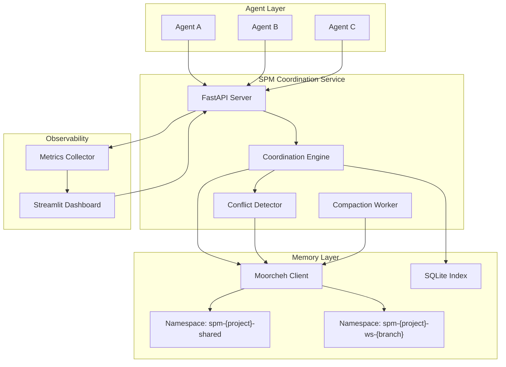
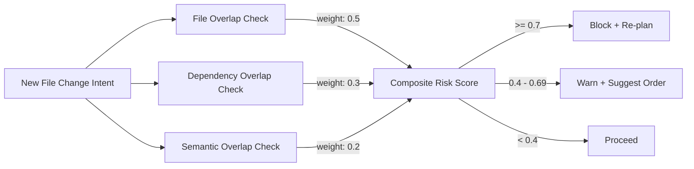
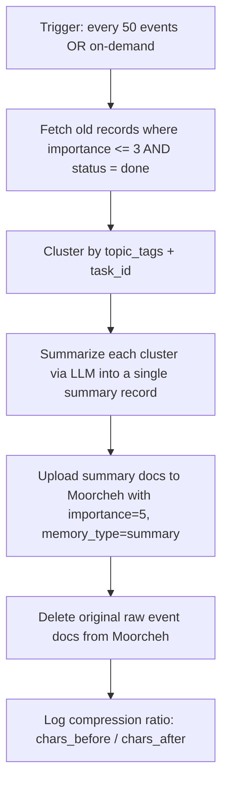

# Shared Agent Memory Layer -- Full Technical Plan

## Thesis: Why This Wins Both Tracks

The project is a **Shared Project Memory Layer** (SPM) that coordinates multiple AI coding agents through a centralized semantic memory plane powered by Moorcheh. It targets both prizes simultaneously because:

- **Bitdeer (Production-Ready):** Multi-agent coordination is the #1 unsolved pain point in AI-assisted development today. Agents working in parallel cause merge conflicts, duplicate reasoning, and lost architectural decisions. SPM is a production-grade middleware that solves this with a clear API, robust error handling, graceful degradation, and a polished dashboard. It is not a toy demo -- it is infrastructure.
- **Moorcheh (Efficient Memory):** SPM generates a *high volume* of heterogeneous memory records (task claims, plans, file intents, decisions, conflict alerts). Without efficient memory, context windows explode and retrieval degrades. Moorcheh's MIB+ITS stack (32x compression, deterministic exhaustive search) is the *only* reason this architecture is viable at scale. The demo will prove this with measurable compression ratios, retrieval latency benchmarks, and grounding accuracy before/after compaction.

The pitch: **"Memory-in-a-Box becomes a multi-agent brain."**

---

## Architecture




### Component Responsibilities

- **FastAPI Server** (`src/api/`): REST API that agents call. Endpoints for claims, intents, plans, decisions, conflicts, merges, context queries. Health checks, OpenAPI docs, structured error responses.
- **Coordination Engine** (`src/core/coordination.py`): Orchestrates task claiming, execution ordering, and merge protocols. Stateless -- all state lives in Moorcheh.
- **Conflict Detector** (`src/core/conflict.py`): Three-channel detection: file-path overlap (deterministic), dependency-graph overlap (metadata query), semantic overlap (Moorcheh similarity search). Produces a composite risk score.
- **Compaction Worker** (`src/core/compactor.py`): Periodic job that clusters old low-importance records by topic, synthesizes summaries via LLM, uploads summary docs to Moorcheh, and deletes raw events. This is the centerpiece for the efficient-memory narrative.
- **Moorcheh Client Wrapper** (`src/memory/store.py`): Thin abstraction over the Moorcheh SDK that handles namespace lifecycle, document CRUD, similarity search, and grounded answer generation. Includes retry logic and local JSON fallback for offline resilience.
- **SQLite Index** (`src/memory/index.py`): Lightweight deterministic index for fast lookups by exact file path, agent ID, task status, and timestamp ranges. Moorcheh handles semantic queries; SQLite handles structured filters. Together they form a hybrid retrieval layer.
- **Streamlit Dashboard** (`src/ui/app.py`): Real-time view of active claims, conflict alerts, memory stats (doc count, total chars, compression ratio), retrieval latency histogram, and a query console for ad-hoc questions against the shared memory.
- **Metrics Collector** (`src/metrics/`): Wraps every Moorcheh call to record latency, tracks compression ratios, grounding rates, and conflict prevention stats. Powers both the dashboard and the demo narrative.

---

## Why Moorcheh Enables Efficient Memory (Judge Arguments)

### 1. Information-Theoretic Compression is Essential, Not Optional

Multi-agent workflows generate memory at O(agents x tasks x actions) rate. A 3-agent session touching 10 files can produce 50-100+ memory records in an hour. Without compression, retrieval context becomes noisy and slow. Moorcheh's MIB (Maximally Informative Binarization) reduces storage by **32x** vs. traditional vector DBs while maintaining retrieval accuracy. This means SPM can retain weeks of project history in the space other systems need for hours.

### 2. Deterministic Exhaustive Search Prevents Silent Failures

Traditional ANN (HNSW) indexes are probabilistic -- they can miss relevant results under load. For conflict detection, a missed result means a missed conflict, which means a broken merge. Moorcheh's ITS scoring performs *deterministic exhaustive search* over binary representations, guaranteeing that similar file intents will always surface. This is a correctness requirement, not just a performance one.

### 3. Bounded Retrieval Budget + App-Level Compaction = Predictable Memory Cost

SPM enforces `top_k` caps (3-5) on every retrieval call and runs compaction loops that:

- Group old events by topic/task.
- Synthesize summary records (importance=5, memory_type=summary).
- Delete raw low-importance events.
- Preserve high-importance decisions uncompressed.

This creates a **memory ceiling** that grows logarithmically with project activity instead of linearly. The demo will show concrete compression ratios (target: 5-10x at the application layer, on top of Moorcheh's 32x at the storage layer).

### 4. Grounded Answers with Citations = Verifiable Memory

Every answer from `answer.generate` cites specific memory records by ID and timestamp. This means agents and humans can audit *why* the system recommended a particular execution order or flagged a conflict. Grounding rate (fraction of answers with valid cited records) is a first-class metric.

---

## Why This Is Production-Ready (Judge Arguments)

### 1. Real Problem, Real Users

Cursor, Windsurf, Aider, Devin -- all modern coding agents operate in isolation. When two agents touch the same file, the user resolves the mess manually. SPM eliminates this with a coordination protocol that is agent-framework agnostic (any agent that can make HTTP calls can participate).

### 2. Professional-Grade Engineering

- **FastAPI** with Pydantic models, OpenAPI docs, structured error responses.
- **Typed Python** throughout (dataclasses or Pydantic for every schema).
- **Graceful degradation**: local JSON fallback if Moorcheh API is unreachable; SQLite index survives network partitions.
- **Health checks**: `/health` endpoint that verifies Moorcheh connectivity, namespace existence, and SQLite integrity.
- **Configuration**: environment-based config via `.env` / `pydantic-settings`, no hardcoded values.
- **Logging**: structured JSON logs with correlation IDs per agent request.
- **Testing**: pytest suite with mocked Moorcheh client for deterministic CI.

### 3. Clear Path to Production Deployment

- Docker-compose with FastAPI + Streamlit + SQLite volumes.
- Documented API contract (OpenAPI spec auto-generated).
- Rate limiting and request validation at the API boundary.
- Namespace-per-project isolation means multi-tenant by design.

### 4. Measurable Outcomes

Every claim in the demo is backed by a metric:

- Conflict prevention rate, duplicate-work reduction, compression ratio, retrieval latency, grounding rate, decision recall accuracy.

---

## Memory Document Schema (Moorcheh Text Namespace)

All records share base fields and are differentiated by `record_type`:

```python
@dataclass
class MemoryRecord:
    id: str               # "{type}:{project}:{timestamp}:{uuid4_short}"
    record_type: str      # task_claim | plan_step | decision | file_change_intent |
                          # dependency_edge | conflict_alert | merge_event | summary
    project_id: str
    workspace_id: str     # "shared" or branch name
    agent_id: str
    timestamp: str        # ISO 8601
    text: str             # natural-language summary for semantic retrieval
    importance: int       # 1..5
    status: str           # open | in_progress | done | blocked | superseded
    payload: dict         # type-specific fields (see SHARED_PROJECT_MEMORY_TECHNICAL.md)
```

The `text` field is what Moorcheh indexes for similarity search. The `payload` dict is serialized into the document for structured access after retrieval. This keeps the Moorcheh document format flat while retaining rich typed data.

---

## Conflict Detection Algorithm




- **File overlap**: exact path intersection via SQLite query (O(1) lookup).
- **Dependency overlap**: query `dependency_edge` records in SQLite for shared imports/calls.
- **Semantic overlap**: `similarity_search.query` on the intent's `text` against existing open intents in Moorcheh. Score > threshold = overlap.

This is where Moorcheh's deterministic search is critical -- we cannot afford to miss a semantically overlapping intent.

---

## Compaction Strategy (Memory Efficiency Centerpiece)




Key design decisions:

- High-importance records (decisions, conflict resolutions) are **never** compacted -- they remain as-is for full auditability.
- Summaries reference `compressed_from_ids` so provenance is traceable.
- Compaction is idempotent: re-running on already-compacted windows is a no-op.
- The LLM summarizer can be OpenAI, Anthropic, or a local model -- configurable via env var.

---

## File Structure

```
src/
  api/
    server.py          # FastAPI app, routes, middleware
    models.py          # Pydantic request/response schemas
    deps.py            # dependency injection (store, engine)
  core/
    coordination.py    # task claim, execution ordering
    conflict.py        # three-channel conflict detection
    compactor.py       # compaction loop + LLM summarizer
  memory/
    store.py           # Moorcheh client wrapper + fallback
    index.py           # SQLite deterministic index
    schemas.py         # MemoryRecord dataclass + type payloads
  metrics/
    collector.py       # latency, compression, grounding tracking
    dashboard.py       # metrics aggregation for UI
  ui/
    app.py             # Streamlit dashboard
  config.py            # pydantic-settings based configuration
  main.py              # entrypoint
scripts/
  ingest_demo.py       # scripted demo scenario ingestion
  run_demo.py          # end-to-end demo runner
  benchmark.py         # metrics measurement script
tests/
  test_store.py
  test_coordination.py
  test_conflict.py
  test_compactor.py
  conftest.py          # shared fixtures, mocked Moorcheh client
requirements.txt
Dockerfile
docker-compose.yml
.env.example
README.md
```

---

## Demo Script (Optimized for Judges)

1. **Setup**: Show clean namespace, empty dashboard. Health check passes.
2. **Agent A** claims auth refactor (`login.py`, `session.py`). Memory records appear on dashboard.
3. **Agent B** proposes DB optimization touching `session.py`. Conflict detector fires -- dashboard shows warning with risk score breakdown (file overlap on `session.py` + semantic overlap on "session management").
4. **System** suggests execution order: A first, then B. Agent B's claim is queued.
5. **Agent C** asks: "What's the current plan for authentication?" System returns grounded answer citing Agent A's plan and decision records, with timestamps and record IDs.
6. **Agent A completes** -- merges to shared workspace. Agent B proceeds.
7. **Run compaction**: 40+ raw events compress to 8 summary records. Dashboard shows compression ratio, char count drop, and retrieval latency comparison.
8. **Repeat Agent C's query** post-compaction: same quality answer, fewer cited records, faster retrieval.
9. **Metrics panel**: conflict prevention rate, compression ratio, avg latency, grounding rate.

---

## 36-Hour Build Schedule

- **Hours 0-2**: Project scaffolding, requirements, config, Moorcheh SDK validation, namespace bootstrap
- **Hours 2-6**: `memory/store.py` + `memory/index.py` + `memory/schemas.py` -- core read/write/query layer with tests
- **Hours 6-12**: `core/coordination.py` + `core/conflict.py` -- task claiming and conflict detection with tests
- **Hours 12-16**: `api/server.py` + `api/models.py` -- FastAPI endpoints wiring core logic
- **Hours 16-20**: `core/compactor.py` -- compaction loop with LLM summarizer
- **Hours 20-26**: `ui/app.py` + `metrics/` -- Streamlit dashboard, metrics collection, visual polish
- **Hours 26-30**: `scripts/ingest_demo.py` + `scripts/run_demo.py` -- scripted demo scenario, benchmark script
- **Hours 30-34**: Integration testing, Docker packaging, offline fallback validation, README
- **Hours 34-36**: Demo rehearsal, metrics capture, presentation prep

---

## Key Dependencies

- `moorcheh-sdk>=1.3.2` -- core memory layer
- `fastapi` + `uvicorn` -- API server
- `pydantic` + `pydantic-settings` -- schemas + config
- `streamlit` -- dashboard UI
- `openai` or `anthropic` -- LLM for compaction summaries
- `sqlite3` (stdlib) -- deterministic index
- `pytest` + `httpx` -- testing
- `structlog` -- structured logging

---

## Risk Mitigations

- **Moorcheh API down**: Local JSON namespace snapshot as deterministic fallback for demo. Store writes queued and replayed on reconnect.
- **Over-scoping**: Core loop is ingest -> query -> compact. Everything else is additive polish. If time runs short, skip Docker/tests and focus on demo script.
- **LLM summarizer unreliable**: Rule-based fallback summarizer (concatenate + truncate) if API calls fail.
- **Slow Moorcheh uploads**: Batch documents (SDK supports bulk upload). Add `time.sleep(2)` after batch writes per SDK guidance.

